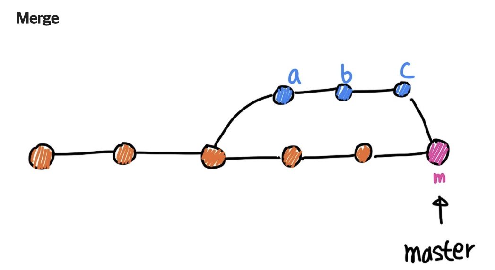
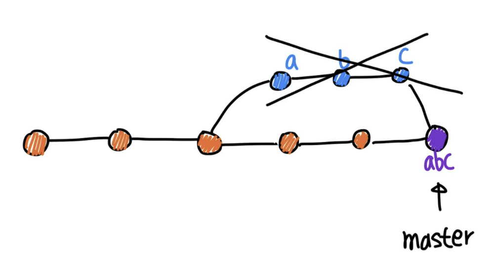

# Git

---

## Git에 대해서

### Git 용어

#### 4. Git 이력을 발전, 표시, 수정

- branch : branch들을 열거하고, 생성하고, 삭제

```zsh
# branch 목록 표시
git branch

# branch 생성
git branch [생성 브랜치 이름]

# branch 삭제
git branch -d [삭제 브랜치 이름]

# branch 상세정보 확인
git branch -v

# branch 이동(checkout)
git checkout [이동할 브랜치 이름]

# branchh 생성 및 이동
git checkout -b [생성 브랜치 이름]
```

- commit : repository의 변화를 기록

```zsh
# git commit
git commit

# git commit에 메세지까지 함께 작성
git commit -m "[메세지]"

# git add와 함께
git commit -am "[메세지]"

# git commit 수정
git commit --ament -m "[변경 메세지]"
```

- <Vi 입력관련 정보>

| 작업 | Vi 명령어 | 상세 |
| --- | --- | --- |
| 입력 시작 | i | 명령어 입력 모드에서 텍스트 입력 모드로 전환 |
| 입력 종료 | ESC | 텍스트 입력 모드에서 명령어 입력 모드로 전환 |
| 저장 없이 종료 | :q |  |
| 저장 없이 강제 종료 | :q! | 입력한 것이 있을 때 사용 |
| 저장하고 종료 | :wq | 입력한 것이 있을 때 사용 |
| 위로 스크롤 | ㅏ | git log 등에서 내역이 길 때 사용 |
| 아래로 스크롤 | j | git log 등에서 내역이 길 때 사용 |

- merge : 2개 혹은 그 이상의 기록을 합한다.
- rebase : 특정 branch 최상단에 추가
  - merge commit
  - squash merging
  - rebase merging



```zsh
# merge commit
# merge 후 m은 2개의 parent를 가짐
git checkout [base branch]
git merge [합칠 branch]
```



```zsh
# squash merging
# merge 후 abc는 1개의 parent를 가짐
git checkout [base branch]
git merge --squash [합칠 branch]
git commit -m "[메세지]"
```


```zsh
# rebase merging
# merge 후 각 commit은 하나의 parent만 가짐
git checkout [합칠 branch]
git rebase [base branch]
git checkout [base branch]
git merge [합칠 branch]
```

- reset : 현재 HEAD를 특정 위치로 재설정 / 시간을 완전히 과거 특정 사건 시점으로 이동
  - 혼자만 사용하는 branch인 경우
  - origin에 있지만 아무도 이 branch를 사용하지 않는다는 확신이 있는 경우
- revert : commit을 추가하여 코드 되돌림 / 현재에 있으면서 과거의 특정 사건들만 없던 일로 만듬

```zsh
# git reset
git reset [특정 commit 시점]
git reset HEAD

# git reset --hard
# 돌아간 시점 이후 commit 이력/파일 모두 삭제
git reset --hard [특정 commit 시점]

# git reset --mixed
# 돌아간 시점 이후 commit 이력만 삭제 / 파일은 존재(add, commit 필요)
git reset --mixed [특정 commit 시점]

# git reset --soft
# 돌아간 시점 이후 commit 이력만 삭제 / 파일은 존재(add되어 있는 상태, commit 필요)
git reset --soft [특정 commit 시점]
```


```zsh
# git revert
git revert [특정 commit 시점]
```

- switch : branch를 변경한다.

```zsh
# git branch 변경
git switch [변경할 branch]

# git branch 생성 및 변경
git switch -c [생성 및 변경할 branch]
```

- tag : GPG로 된 태그 개체 생성, 목록 표시, 삭제 또는 확인

```zsh
# git 특정 commit에 tag 생성
git tag [태그 이름]

# tag 조회
git tag
git tag -l [특정 tag 조건]

# 원격 저장소 tag 조회
git ls-remote --tags
```

#### 5. 협업


- fetch : 다른 repository로부터 객체, 참조 다운로드

```zsh
# 원격 저장소와 commit 업데이트
git fetch
```

- pull : 다른 repository 또는 로컬 branch와 통합

```zsh
# 원격 저장소와 동기화
git pull
```

- push : 원격 저장소에 로컬의 commit을 update

```zsh
# 원격 저장소에 로컬 기록 update
git push
```

- git merge 참고 url : https://velog.io/@injoon2019/Git-Merge-종류
- git merge 참고 url2 : https://im-developer.tistory.com/182

