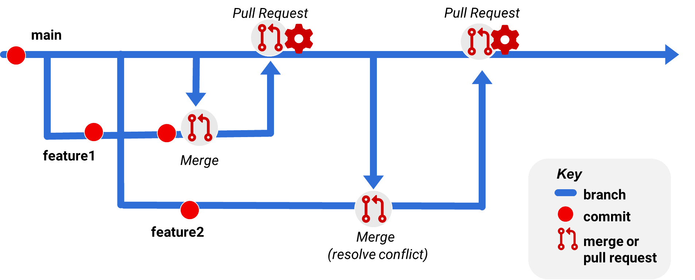
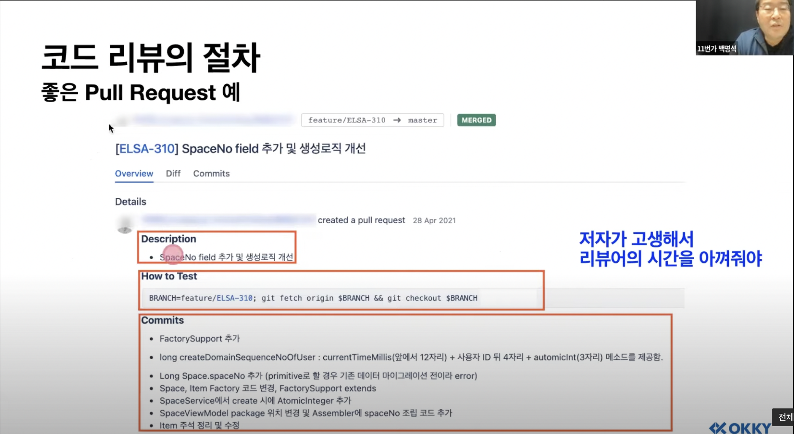
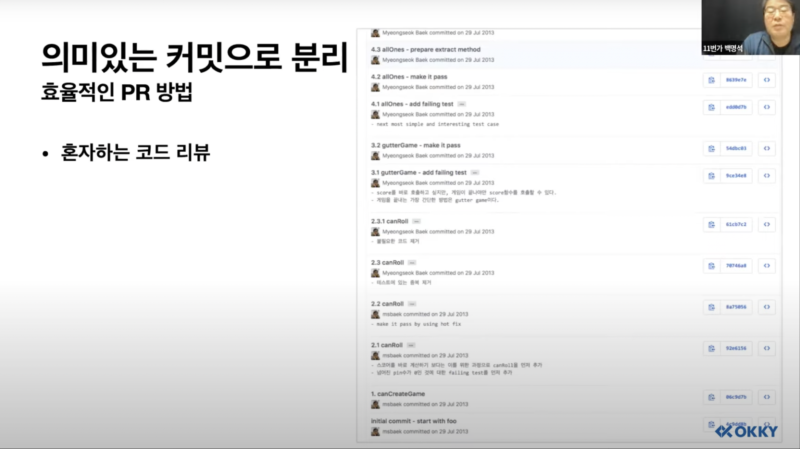

# Git

---

## Git에 대해서

### Pull Request (PR)

- Pull requests let you tell others about changes you've pushed to a branch in a repository
- Pull request란 자신이 특정 branch에서 변경 사항을 다른 사람에게 알리는 것

#### PR 구성요소
 - 작업 제목 : Title
 - 내용 설명 : Write
 - Commit Log : Commit List
 - 리뷰어 : Reviewers

#### 좋은 PR 예

