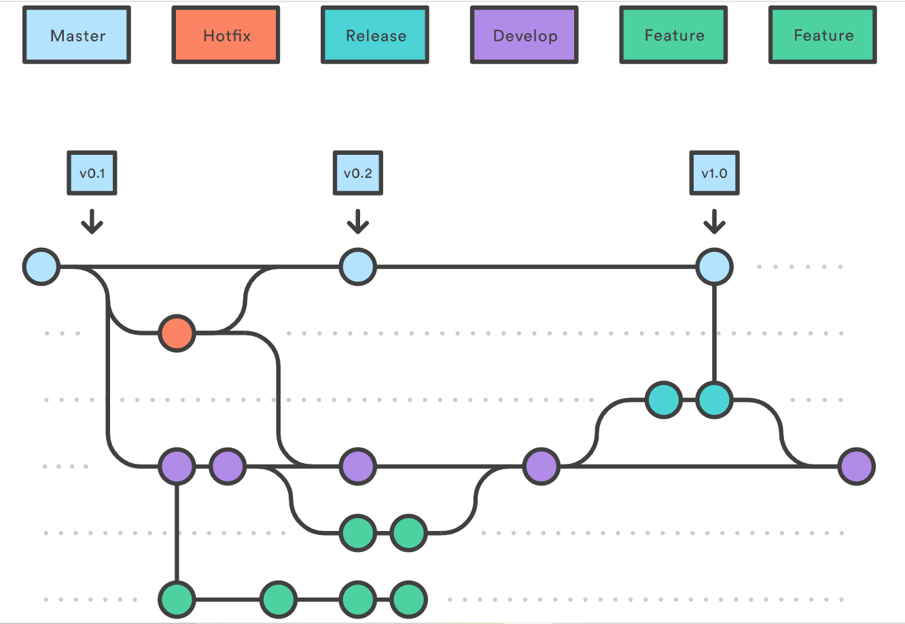

# Git

---

## Git Workflow

- **Git Workflow** : Git의 branch를 활용하여 팀에서 어떻게 협업을 할지 정하는 규칙
  - Git flow
  - Github flow
  - Gitlab flow

### Git flow

- **Git flow** : 가장 처음 제안된 Workflow이며, branch가 많고 복잡하며, 대규모 프로젝트에서 적합한 방식

  
  
  

1. Master : 중심이 되는 branch이며, 최종 릴리즈되는 branch
2. Develop : 중심이 되는 branch이며, 다음 릴리즈를 위한 개발의 메인 branch
3. Feature : orgin에 반영이 되는게 아닌 개발자 repo에만 존재하며, develop branch에서 파생되어 기능 개발 완료 후 develop branch에 Merge하고 삭제된다.
4. Release : 기능 개발 완료 후 차기 릴리즈를 위한 준비 branch, bug fix에 대한 커밋만 이뤄진다.
5. Hotfix : 현재 릴리즈 버전에 대한 버그를 처리하는 branch, bug fix 후 master, develop branch에 모두 merge

### Github flow

- **Github flow** : 하나의 Master branch만 매우 엄격하게 관리하고, 용도별 branch 생성하고 Master branch에 Merge 전 PR(Pull Request)를 통해 코드 리뷰 진행. Merge가 완료되면 바로 배포 진행
  
  

### Gitlab flow

- **Gitlab flow** : 2개의 중심 branch를 관리, Github flow와 다르게 Master branch를 항상 최신 버전으로 유지하지 않아도 됨

- 참고 사이트
  - https://nvie.com/posts/a-successful-git-branching-model/
  - https://vntgcorp.github.io/Git/
  - http://cishome.tistory.com

