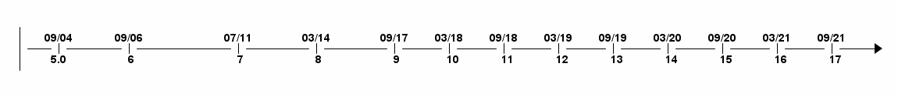

# Java

---

## Java Versions & Features

### Java Version Release



- 가장 최근 버전 : Java 17 (LTS - Long Term Support)
- Java 9 버전 이후 릴리즈 주기 6개월 고정
- Java 17 버전 이후 LTS 주기 2년 고정

### JRE & JDK

#### JRE - Java Runtime Environment

- Java 응용 프로그램을 **<span style="color:Blue">실행**하는데 필요한 파일의 조합

#### JDK - Java Development Kit

- Java 응용 프로그램을 **<span style="color:Blue">개발**하는데 필요한 kit

### Java Distributions

0. Open JDK 프로젝트
> - Java 소스코드의 경우 Open JDK 프로젝트 사이트에 존재하는 유일한 소스코드
> - http://openjdk.java.net/projects/jdk/
> - 소스코드일 뿐 배포 가능한 빌드가 아님
  >   - 이론적으로, 해당 소스코드로 빌드를 만들 수는 있음
> - 인증을 받아 배포하기가 쉽지 않아 배포하는 벤더가 많지 않음


1. Open JDK & Oracle JDK

> - Open JDK : Oracle에 의해 빌드되며 무료 / Oracle GPL v2 라이센스
> - Oracle JDK : 개발 중에는 무료지만, 상용화할 경우 Oracle에 비용을 지불 필요 / Oracle BCL(Binary Code License) Agreement 라이센스
> - Oracle JDK의 경우 LTS 업데이트 지원을 받을 수 있음, Open JDK는 6개월
> - Oracle JDK는 Oracle이 인수한 Sun Microsystems 플러그인을 제공
> - Oracle JDK는 OpenJDK 보다 CPU 사용량과 메모리 사용량이 적고, 응답시간이 높음

2. Adoptium(이전 AdoptOpen JDK)

> - 2017년에 Java 사용자 그룹 구성원, 개발자 및 공급업체 등이 모여 AdoptOpen JDK 커뮤니티를 만들었다.

3. Azul Zulu, Amazon Corretto, SAPMachine

### Java Version Features

#### Java 8
> - Java 8은 대규모 변경이 있었던 릴리즈
> - Lambda, Streams, interface default method, Optional, new Date and Time API...
- Lambda : 익명 클래스의 사용을 람다를 통해 더욱 간결하고 직관적으로 구현 가능
```java
// 이전
Runnable runnable = new Runnable(){
    @Override
    public void run(){
        System.out.println("Hello world !");
    }
};
```
```java
// java8
Runnable runnable = () -> System.out.println("Hello world two!");
```
- Stream : 모호함과 반복적인 코드 문제, 멀티코어 활용 어려움 해결
```java
// 이전
List<String> list = Arrays.asList(*"franz"*, *"ferdinand"*, *"fiel"*, *"vom"*, *"pferd"*);
```
```java
// java 8 이후
list.stream()
        .filter(name -> name.startsWith(*"f"*))
        .map(String::toUpperCase)
        .sorted()
        .forEach(System.out::println);
```

#### Java 9
> - 모듈시스템 등장(jigsaw)
> - Collection, Stream, optional, interface...
- Collection : list, set, map을 쉽게 구성할 수 있는 몇가지 추가 기능
```java
List<String> list = List.of(*"one"*, *"two"*, *"three"*);
Set<String> set = Set.of(*"one"*, *"two"*, *"three"*);
Map<String, String> map = Map.of(*"foo"*, *"one"*, *"bar"*, *"two"*);
```
- Steam : takeWhile, dropWhile, iterate 메서드의 형태로 몇 가지 추가 기능
```java
Stream<String> stream = Stream.iterate(*""*, s -> s + *"s"*)
  .takeWhile(s -> s.length() < 10);
```
- optional : ifPresentOrElse 추가 기능
```java
user.ifPresentOrElse(this::displayAccount, this::displayLogin);
```
- interface : 인터페이스에 private method 사용 가능
```java
public interface MyInterface {

    private static void myPrivateMethod(){
        System.out.println(*"Yay, I am private!"*);
    }
}
```
- 가타 언어 기능 : try-with-resources 문 또는 다이아몬드 연산자(<>) 확장, HTTP클라이언트와 같은 몇 가지 다른 개선 사항 존재

#### Java 10
> - 가비지 컬렉션 등의 변경 사항이 있지만, 개발자로서 확인 가능한 변경점은 "var" 키워드 도입
> - var 키워드, 별렬 처리 가비지 컬렉션 도입으로 인한 성능 향상, JVM 힙 영경을 시스템 메모리가 아닌 다른 종류의 메모리에도 할당 가능
- var 키워드 : 지역 변수 타입 추론을 허용, **매서드 내부의 변수에만 적용 가능**
```java
// 이전
String myName = "Marco";
```
```java
// java 10 이후
var myName = "Marco"
```

#### Java 11
> - Oracle JDK와 Open JDK 통합
> - Oracle JDK의 구독형 유료 모델 전환
> - Strings & Files, Run Source Files, 람다 매개변수에 대한 지역 변수 유형 추론(var)
- Strings & Files : 새로운 매서드 추가
```java
*"Marco"*.isBlank();
*"Mar\nco"*.lines();
*"Marco  "*.strip();

Path path = Files.writeString(Files.createTempFile(*"helloworld"*, *".txt"*), *"Hi, my name is!"*);
String s = Files.readString(path);
```
- Run Source Files : 컴파일 하지 않고 실행 가능
```java
ubuntu@DESKTOP-168M0IF:~$ java MyScript.java
```
- 람다 매개변수에 대한 지역 변수 유형 추론(var) : 람다 표현식에 var 사용 가능
```java
(var firstName, var lastName) -> firstName + lastName
```

#### Java 12
> - 유니코드 11 지원과 새로운 스위치 표현식의 preview

#### Java 13
> - 스위치 표현식(preview), Multiline Strings (Preview)
- 스위치 표현식(preview) : 스위치 표현식이 값을 반환 가능하며 fall-through/break 문제 없이 표현식에 람다 스타일 구문을 사용 가능
```java
// 이전
switch(status) {
  case SUBSCRIBER:
    *// code block*break;
  case FREE_TRIAL:
    *// code block*break;
  default:
    *// code block*}
```
```java
// java 13 이후
boolean result = switch (status) {
    case SUBSCRIBER -> true;
    case FREE_TRIAL -> false;
    default -> throw new IllegalArgumentException(*"something is murky!"*);
};
```
- Multiline Strings (Preview)
```java
// 이전
String htmlBeforeJava13 = *"<html>\n"* +
        *"    <body>\n"* +
        *"        <p>Hello, world</p>\n"* +
        *"    </body>\n"* +
        *"</html>\n"*;
```
```java
// java 13 이후
String htmlWithJava13 = *"""
              <html>
                  <body>
                      <p>Hello, world</p>
                  </body>
              </html>
              """*;
```

#### Java 14
> - 스위치 표현(Standard), record(preview), 유용한 NullPointerExceptions, Pattern Matching For InstanceOf (Preview)
- 스위치 표현(Standard) : preview였던 스위치 표현식의 표준화
```java
int numLetters = switch (day) {
    case MONDAY, FRIDAY, SUNDAY -> 6;
    case TUESDAY                -> 7;
    default      -> {
      String s = day.toString();
      int result = s.length();
      yield result;
    }
};
```
- record(preview) : 많은 상용구 작성에 도움이 되는 레코드 클래스 도입
```java
// 이전 : 데이터, (잠재적으로) getter/setters, equals/hashcode, toString만 포함
final class Point {
  public final int x;
  public final int y;

  public Point(int x, int y) {
    this.x = x;
    this.y = y;
  }
}
    *// state-based implementations of equals, hashCode, toString// nothing else*
```
```java
// java 14 이후
record Point(int x, int y) { }
```
- 유용한 NullPointerExceptions : 정확히 어떤 변수가 null인지 설명
```java
author.age = 35;
---
Exception in thread *"main"* java.lang.NullPointerException:
     Cannot assign field *"age"* because *"author"* is null
```
- Pattern Matching For InstanceOf (Preview) 
```java
// 이전 : instanceof 내부에서 객체를 캐스팅 필요
if (obj instanceof String) {
    String s = (String) obj;
    *// use s*}
```
```java
// java 14 이후
if (obj instanceof String s) {
    System.out.println(s.contains(*"hello"*));
}
```

#### Java 15
> - Text-Blocks / Multiline Strings
> - Records & Pattern Matching(2차 preview, 상단 Java 14 참조)
> - 스케일링 가능한 낮은 지연의 가비지 컬렉터 추가(ZGC)
> - 레코드 (2차 preview, 상단 Java 14 참조)
> - Sealed Classes - Preview
> - Nashorn JavaScript Engine 제거
- Text-Blocks / Multiline Strings : 정식 표준화
```java
String text = *"""
                Lorem ipsum dolor sit amet, consectetur adipiscing \
                elit, sed do eiusmod tempor incididunt ut labore \
                et dolore magna aliqua.\
                """*;
```
- Sealed Classes - Preview : 상속 가능한 클래스를 지정할 수 있는 봉인 클래스 제공, 상속 가능한 대상은 상위 클래스 또는 인터페이스 패키지 내에 속해야 함
```java
// 즉, 클래스가 public인 동안 하위 클래스로 허용되는 유일한 Shape 클래스들은 Circle, Rectangle 및 Square 이다.
public abstract sealed class Shape
    permits Circle, Rectangle, Square {...}
```

#### Java 16
> - Pattern Matching for instanceof
> - Unix-Domain Socket Channels
> - Foreign Linker API - Preview
> - Records & Pattern Matching
- Pattern Matching for instanceof
```java
// 이전
if (obj instanceof String) {
    String s = (String) obj;
    // e.g. s.substring(1)
}
```
```java
// java 17 이후
if (obj instanceof String s) {
    // Let pattern matching do the work!
    // ... s.substring(1)
}
```
- Unix-Domain Socket Channels
```java
socket.connect(UnixDomainSocketAddress.of(
    *"/var/run/postgresql/.s.PGSQL.5432"*));
```

#### Java 17
> - Pattern Matching for switch (Preview)
> - Sealed Classes (Finalized)
> - Foreign Function & Memory API (Incubator)
> - Deprecating the Security Manager
- Pattern Matching for switch (Preview)
```java
public String test(Object obj) {

    return switch(obj) {

    case Integer i -> *"An integer"*;

    case String s -> *"A string"*;

    case Cat c -> *"A Cat"*;

    default -> *"I don't know what it is"*;

    };

}
```

-------------------------------------

* 참고 사이트
  * https://www.marcobehler.com/guides/a-guide-to-java-versions-and-features
  * https://velog.io/@ljo_0920/java-%EB%B2%84%EC%A0%84%EB%B3%84-%EC%B0%A8%EC%9D%B4-%ED%8A%B9%EC%A7%95